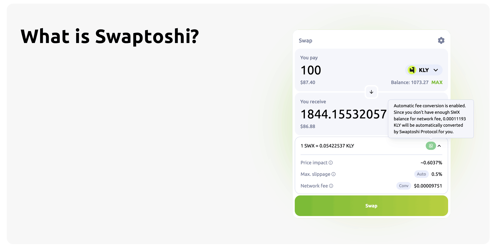

# About Swaptoshi

## Overview

Swaptoshi is a Fair-Launched Community-Driven Klayr DEX!

Built using Klayr SDK, it operates as an independent blockchain sidechain app, fully interoperable with the Klayr mainchain and its ecosystem. To learn more about how the Klayr ecosystem works and how sidechains are built, please visit the [Official Klayr Documentation](https://docs.klayr.xyz).

Swaptoshi offers DEX features inspired by industry best practices, including:

- Concentrated Liquidity AMM
- NFT-Based Liquidity Positions
- Liquid Staking
- Decentralized Treasury Governance

Swaptoshi also introduces new innovations to enhance the trading experience, such as:

- Automatic Network Fee Conversion
- One-Click Token Creation
- Governable Chain Configurations

Additionally, Swaptoshi is powered by its native token, `SWX`, along with its Liquid Staking token, `SWL`

:::info

To learn more about the utility of `SWX` and how it incentivizes network growth and contribution, please head to the [Tokenomics section](./tokenomics.md)

:::

## Modules

Swaptoshi utilizes several on-chain modules, including the [`nft`](https://github.com/klayrhq/klayr-sdk/blob/main/framework/src/modules/nft) module from the Klayr SDK and its own custom modules, to power its features. This section provides a brief overview of our custom modules

For more details, visit the `swaptoshi-core` [GitHub repository](https://github.com/swaptoshi/swaptoshi-core/blob/main/src/app/modules). To view the Swaptoshi network configuration values, check out the [config.json](https://github.com/swaptoshi/swaptoshi-core/blob/main/config/devnet/config.json) file in our repository.

:::info

Each of the following Swaptoshi modules config uses `GovernableConfig` powered by the `governance` module, allowing configurations to be modified based on community decisions. To learn more about Swaptoshi's governance, visit the [Governance Section](./governance.md).

:::

:::note

These modules will also be included in the `Swaptoshi SDK` upon release, allowing Klayr sidechain developers to create their own unique use cases.

:::

### dex

The `dex` module implements Concentrated Liquidity AMM, following best practices from industry leaders like Uniswap V3. It supports commands for swapping, minting/burning positions, adjusting liquidity, and collecting position earnings. Additionally, it includes commands for transferring leftover pool balances to the treasury and collecting earnings owned by the treasury.

The `dex` module includes following configurations:

| **Config**              | **Type**         | **Description**                                                                                                                                                                                                                                                                  |
| ----------------------- | ---------------- | -------------------------------------------------------------------------------------------------------------------------------------------------------------------------------------------------------------------------------------------------------------------------------- |
| `feeAmountTickSpacing`  | Array of Objects | Defines supported fee tiers and their corresponding tick spacing for liquidity pools.                                                                                                                                                                                            |
| `feeProtocol`           | Number           | Represents the protocol fee percentage that is applied on swaps, indicating the share taken by the treasury from swap fees.                                                                                                                                                      |
| `feeProtocolPool`       | String           | Specifies the treasury address where the protocol fees are collected.                                                                                                                                                                                                            |
| `feeConversionEnabled`  | Boolean          | Determines if fee conversion is enabled for swaps, allowing transaction fees to be paid using token other than `SWX`.                                                                                                                                                            |
| `supportAllTokens`      | Boolean          | Indicates whether the DEX module supports accepting all tokens from other sidechains. If `true`, all tokens are automatically supported and can be transferred cross-chain to the Swaptoshi chain. If `false`, a token must have a liquidity pool before transfers are accepted. |
| `nftPositionMetadata`   | Object           | Set metadata about the NFT positions in both the `dex` chain and mainchain, including name, symbol, and decimal information.                                                                                                                                                     |
| `nftPositionColorRange` | Object           | Defines the color range for NFTs in terms of hue, saturation, and lightness, used for visual representation of positions.                                                                                                                                                        |
| `minTransactionFee`     | Object           | Specifies the minimum fee that will be checked during the `verifyTransaction` hook of each command.                                                                                                                                                                              |
| `baseFee`               | Object           | Defines the base fee that will be deducted from every transaction.                                                                                                                                                                                                               |

### tokenFactory

The `tokenFactory` module allows for easy issuance of new tokens without the need for additional sidechain or node deployments. It also includes commands for post-creation activities like airdrops and ICO management.

The `tokenFactory` module includes following configurations:

| **Config**                | **Type**         | **Description**                                                                                                                                                                                                    |
| ------------------------- | ---------------- | ------------------------------------------------------------------------------------------------------------------------------------------------------------------------------------------------------------------ |
| `skippedTokenID`          | Array of strings | Lists token IDs that are excluded from the factory create operation, ensuring compatibility with other modules when a specific token ID is reserved for a particular purpose (e.g., LST token).                    |
| `icoLeftOverAddress`      | String           | Specifies the address where leftover tokens from an ICO pool are sent. Leftovers can occur if a pool address receives a transfer before being set up as an ICO pool.                                               |
| `icoFeeConversionEnabled` | Boolean          | Determines if fee conversion is enabled for ICO purchase, allowing transaction fees to be paid using token other than `SWX`.                                                                                       |
| `icoDexPathEnabled`       | Boolean          | Determines if ICOs can use DEX paths for trading or conversions during the token purchase process. If set to `false`, `tokenFactory:icoExactInput` and `tokenFactory:icoExactOutput` transaction will be disabled. |
| `minTransactionFee`       | Object           | Specifies the minimum fee that will be checked during the `verifyTransaction` hook of each command.                                                                                                                |
| `baseFee`                 | Object           | Defines the base fee that will be deducted from every transaction.                                                                                                                                                 |

### liquidPos

The `liquidPos` module provides liquid staking functionality, automatically minting a specific LST token when the native token is staked in PoS and vice versa.

The `liquidPos` module includes following configurations:

| **Config** | **Type** | **Description**                                                                       |
| ---------- | -------- | ------------------------------------------------------------------------------------- |
| `tokenID`  | String   | Specifies the unique identifier for the token used as the LST token.                  |
| `ratio`    | Number   | Defines the ratio of liquid LST to staked native token. This config is not governable |

### feeConversion

The `feeConversion` module allows transaction fees to be paid with a non-native chain token. For example, you can use `KLY` instead of `SWX` to cover transaction fees.

The `feeConversion` module includes following configurations:

| **Config**       | **Type**         | **Description**                                                           |
| ---------------- | ---------------- | ------------------------------------------------------------------------- |
| `conversionPath` | Array of strings | Lists the custom conversion paths other than native token liquidity pair. |

:::info

Non-native tokens must meet specific rules to enable fee conversion. For more details, check out the [Fee Conversion Section](./tokenomics#fee-conversion) on Tokenomics page.

:::

### governance

The `governance` module handles treasury management and on-chain configuration modification through DAO proposals.

The `governance` module includes following configurations:

| **Config**                   | **Type** | **Description**                                                                                                                                                             |
| ---------------------------- | -------- | --------------------------------------------------------------------------------------------------------------------------------------------------------------------------- |
| `governGovernanceConfig`     | Boolean  | Determines if this governance configuration is governable.                                                                                                                  |
| `proposalCreationMinBalance` | String   | Specifies the minimum balance required to create a proposal.                                                                                                                |
| `proposalCreationDeposit`    | String   | Defines the deposit amount needed to submit a proposal.                                                                                                                     |
| `maxProposalActions`         | Number   | Sets the maximum number of actions that can be included in a single proposal.                                                                                               |
| `votingDelayDuration`        | Number   | Indicates the delay period in block height before voting starts on a proposal.                                                                                              |
| `voteDuration`               | Number   | Defines the length of time in block height available for voting on a proposal.                                                                                              |
| `quorumDuration`             | Number   | Specifies the block height frame within which quorum must be reached for a proposal to be valid.                                                                            |
| `executionDuration`          | Number   | Sets the block height duration within which a proposal, once approved, must be executed.                                                                                    |
| `quorumTreshold`             | String   | Defines the threshold needed to meet quorum for proposal approval. This can be expressed as a percentage string (e.g., "5%") or as an exact value required to reach quorum. |
| `quorumMode`                 | Number   | Specifies the mode of quorum calculation: 0 (FOR_AGAINST_ABSTAIN), 1 (FOR_AGAINST), or 2 (FOR).                                                                             |
| `depositPoolAddress`         | String   | Indicates the receiving address for the transferred deposit if quorum is not reached.                                                                                       |
| `enableTurnoutBias`          | Boolean  | Determines if turnout bias is enabled, affecting proposal voting based on participation.                                                                                    |
| `enableBoosting`             | Boolean  | Indicates if vote power boosting is enabled, which enhances voting power based on how long tokens are locked.                                                               |
| `maxBoostDuration`           | Number   | Sets the maximum block height duration for which a vote can be locked for boosting.                                                                                         |
| `boostFactor`                | Number   | Defines the factor by which boosted vote are amplified in terms of voting weight.                                                                                           |
| `treasuryAddress`            | String   | Specifies the address of the treasury where governance rewards are distributed.                                                                                             |
| `treasuryReward`             | Object   | Details the reward structure from the treasury, including token ID, reward offsets, distance, and brackets for mint and block rewards.                                      |
| `minTransactionFee`          | Object   | Specifies the minimum fee that will be checked during the `verifyTransaction` hook of each command.                                                                         |
| `baseFee`                    | Object   | Defines the base fee that will be deducted from every transaction.                                                                                                          |
