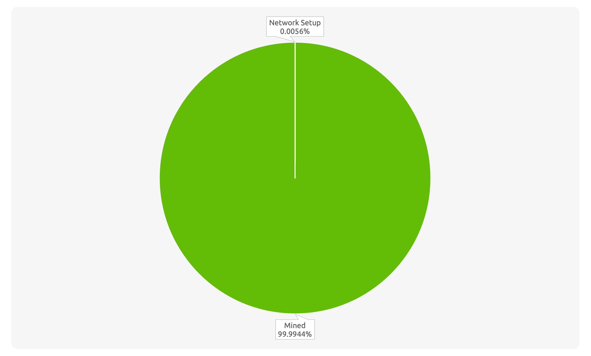
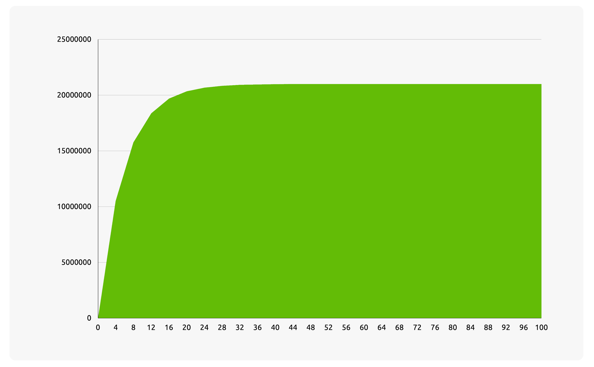

# Tokenomics

This section outlines the economics of `SWX` tokens and their dynamic interactions within the protocol.

:::tip

The tokenomics design is open to community suggestions and input. If you have any ideas or feedback, feel free to [Edit this pages](https://github.com/swaptoshi/swaptoshi-docs/edit/main/content/introduction/tokenomics.md), and open a Pull Request on the [swaptoshi-docs](https://github.com/swaptoshi/swaptoshi-docs) repository.

:::

## Initial Price

The initial price of the SWX token is set at **3.5 KLY/SWX**. This pricing strategy is carefully designed to balance validator incentives with the overall market cap. Here’s a more detailed explanation:

- **Validator Incentive**: The KLY network rewards `2 KLY` per block with a `7-second` block time, resulting in approximately `24,685 KLY` mined daily by 53 validators. For Swaptoshi, `0.25 SWX` per block with a `3-second` block time yields about `7,200 SWX` per day. At a price of `3.5 KLY/SWX`, validators could earn around `25,200 KLY` daily (before distribution among 53 validators), closely matching the KLY daily reward.

- **Reasonable Initial Market Cap**: In the first year, with `0.25 SWX` per block, a `3-second` block time, and `1,193.64 SWX` pre-minted, the total supply will reach `2,629,193.64 SWX`. At a price of `3.5 KLY/SWX`, this results in a value of `9,202,177.74 KLY`, which is approximately `5%` of the KLY market cap.

- **Encourage Growth**: Setting the price at `3.5 KLY/SWX` makes it accessible for newcomers to join the network. Increased participation can drive up sustainable demand, which in turn can boost the token’s value.

:::info

Again, if you have any ideas or feedback about the initial price, feel free to [Edit this pages](https://github.com/swaptoshi/swaptoshi-docs/edit/main/content/introduction/tokenomics.md).

:::

## Allocation & Distribution

`SWX` token is introduced as a fair-launched token, designed as a deflationary token with a fixed total supply of `21,000,000` coins.

At launch, `119,364,000,000 Nakamoto`, equivalent to `1,193.64 SWX` or 0.0056% of the total supply, will be minted for network setup purposes. The remaining `20,998,806.36 SWX`, or 99.9944% of the total supply, will be mined over a period of 100 years.

The pre-minted `243.64 SWX` tokens will be held at the address `klyof58j7a5fvs55utdnv6xmkv3b6swjmjaotbt85`. Meanwhile, at genesis block, `330 SWX` will be [distributed to 33 genesis validator](../launch/mainnet#️-network-setup-phase), and `620 SWX` will be distributed to [20 VIP Validators](../launch/vip).

Below is the table showing the `SWX` block reward over time.

| Year      | Block Reward | Total Supply  |
| --------- | ------------ | ------------- |
| Preminted | 0            | 1,193.64      |
| 0-4       | 0.25         | 10,501,193.64 |
| 4-8       | 0.125        | 15,751,193.64 |
| 8-12      | 0.0625       | 18,376,193.64 |
| 12-16     | 0.03124      | 19,688,273.64 |
| 16-20     | 0.01562      | 20,344,313.64 |
| 20-24     | 0.00781      | 20,672,333.64 |
| 24-28     | 0.0039       | 20,836,133.64 |
| 28-32     | 0.00195      | 20,918,033.64 |
| 32-36     | 0.000975     | 20,958,983.64 |
| 36-40     | 0.000488     | 20,979,479.64 |
| 40-44     | 0.000244     | 20,989,727.64 |
| 44-48     | 0.000122     | 20,994,851.64 |
| 48-52     | 0.000061     | 20,997,413.64 |
| 52-56     | 0.0000305    | 20,998,694.64 |
| 56-60     | 0.000016     | 20,999,366.64 |
| 60-64     | 0.0000076    | 20,999,685.84 |
| 64-68     | 0.0000038    | 20,999,845.44 |
| 68-72     | 0.0000019    | 20,999,925.24 |
| 72-76     | 0.00000095   | 20,999,965.14 |
| 76-80     | 0.00000045   | 20,999,984.04 |
| 80-84     | 0.0000002    | 20,999,992.44 |
| 84-88     | 0.0000001    | 20,999,996.64 |
| 88-92     | 0.00000005   | 20,999,998.74 |
| 92-96     | 0.00000002   | 20,999,999.58 |
| 96-100    | 0.00000001   | 21,000,000.00 |
| >100      | 0            | 21,000,000.00 |

The table above can be visualized in the graph chart below.

:::warning

With current chain configuration, after the block reward reaches 0 (at year 100), validators can still be incentivized by setting `minFeePerByte` to 0, which means transaction fees will be paid to validators. This can be achieved through on-chain configuration modification proposals, if the `fee` module on the Klayr SDK implements the `governance` module; otherwise, it would require a hard fork. For more details, visit the [Governance Section](./governance.md).

:::

## Consensus

`SWX` is used to secure the Swaptoshi protocol network through staking on a Proof-of-Stake (PoS) consensus mechanism.

Swaptoshi network will adopt the Klayr SDK PoS consensus configuration with certain modifications, including a block time of 3 seconds and a `minWeightStandby` configuration of 10 SWX.

Rewards will start at `0.25 SWX` per block and will be halved every `42,000,000 blocks` (approximately every 4 years). The reward distribution will commence after a `201559` block (approximately 7-day) initialization phase, and the final reward will be issued 100 years thereafter.

## Liquid Staking

For every `SWX` that is staked, users will receive a 1:1 equivalent in liquid `SWL`, which can be utilised within the Swaptoshi protocol. This ensures the network remains secure while maintaining liquidity.

To unstake, users must hold a 1:1 equivalent of `SWL` in their wallet.

## Swap Fee & NFT Positions

Every liquidity provider that supplies liquidity will earn a fee from each swap transaction.

Liquidity positions will be represented by NFTs ([LIP-0052](https://github.com/klayrHQ/lips/blob/main/proposals/lip-0052.md)). Since liquidity positions are represented in NFT form, they can be traded and ownership can be transferred. Only the owners of these NFTs can claim rewards from swap fees for each NFT position.

## Fee Conversion

`SWX` is used to pay transaction fees within the network.

However, Swaptoshi implements the `feeConversion` module, which allows users to pay transaction fees without needing to hold `SWX` initially, enhancing the overall user experience for starting swaps.

:::info

The activation condition for the `feeConversion` module is that, the token being swapped must have a liquidity pool against either `SWX` or `SWL`, and liquidity must be available.

For example, if a user wants to swap `KLY` for `PEPX`, and there exists a `KLY/SWX` or `KLY/SWL` liquidity pool, the user does not need to hold `SWX` tokens. In this case, `KLY` will be automatically converted into `SWX` when the swap command is executed on-chain.

This incentivizes token creators to establish liquidity pools for `SWX` or `SWL`, which is expected to enhance the value of both `SWX` and `SWL`.

:::

## Governance

`SWX` is also used for voting on the DAO treasury.

Treasury Address is `klyr49epb3jdyqmnfyrz7jdc5ws3rmyuqzje4c4jb`, which obtained by `SHA256(b"GovernanceTreasuryAccount")[:20]`, as outlined on [LIP-0074](https://github.com/klayrHQ/lips/blob/main/proposals/lip-0074.md)

The treasury will acquire SWX as well as other tokens from the following activities:

- `10%` of each block reward will be transferred to the treasury address.
- Fees from each transaction will not be burned, but will be sent to the treasury. This also ensuring that the total supply of 21 million remains constant.
- Every swap fee received by liquidity providers will be subject to a `10%` deduction, which will be transferred to the treasury

:::info

As outlined in [Governance Section](./governance.md), these behaviours are expected to be configurable and can be decided through on-chain DAO proposals, which are voted on by `SWX` holders.

:::
