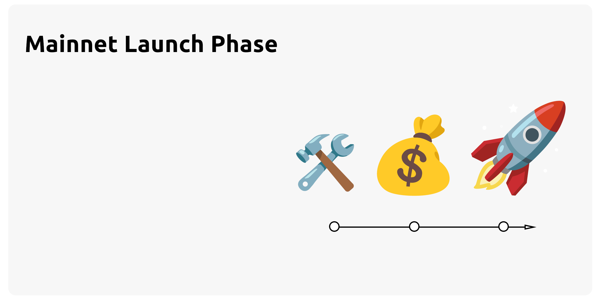

# Mainnet Launch Phase

wip

## Network Setup Phase

- 53 genesis validator
- 7 day initialization pediod, no reward will be minted
- sidechain registration
- 20 VIP program validators

## Liquidity Setup Phase

- KLY/SWX, SWX/SWL pool setup
- reward from 33 genesis validator will be used for liquidity
- reward will be shared as follows: 80% for KLY/SWX liquidity (40:40), 20% for SWX/SWL liquidity (10:10)
- 1 genesis validator will stake to genesis_validator_54 (non forging genesis validator) using 10% reward, SWL will be obtained
- 2% of SWL and 2% of SWX will be used to setup SWX/SWL with full range position. 8% of SWL and 8% of SWX will be used to setup 0.95-1.05 price range
- 40% of SWX earned by genesis validator will be sold for KLY with rate 3.5 KLY/SWX
- KLY earned through this process will be used for KLY/SWX liquidity setup, with full range position
- NFT Position then will be transferred to treasury
- anyone can do dex:collectTreasury transaction

## Validator Decentralization Phase

- anyone can swap KLY to SWX easily, as liquidity now available
- anyone can register as validator
- genesis_validator will lose its forging position gradually over time
- Swaptoshi network will achieve Decentralization!
