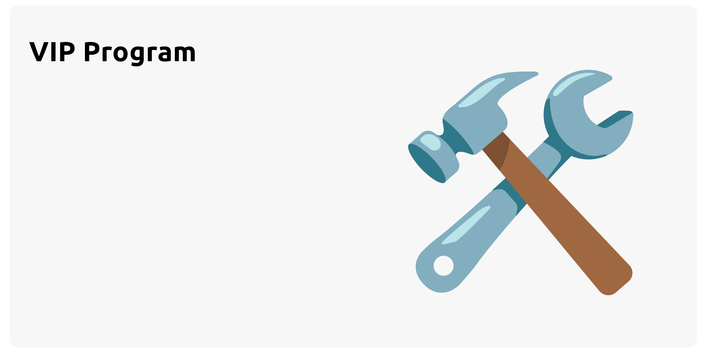
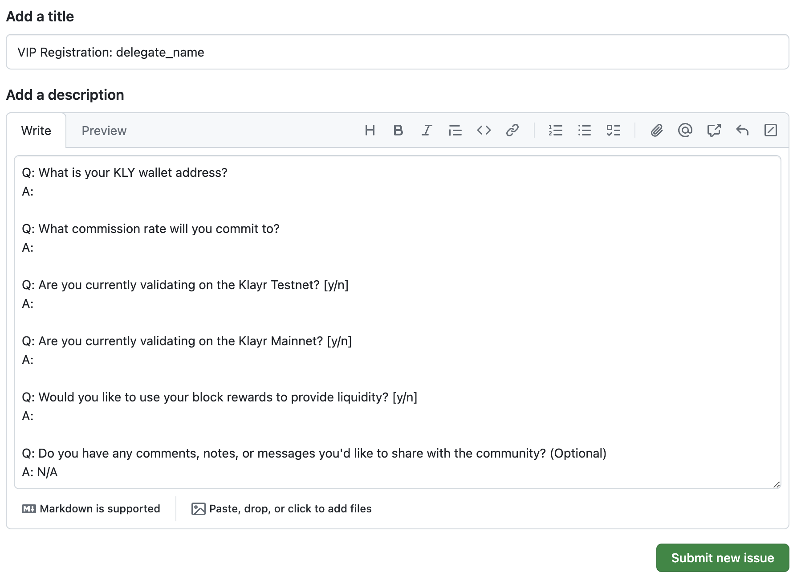

# Validator Initialization Program

The VIP Program is created to jumpstart the network and encourage community involvement, paving the way for Swaptoshi's decentralization.

The VIP Program invites up to 20 community members to play a key role in Swaptoshi's decentralization and future development.

This document will detail the requirements for joining the VIP Program and the incentives offered to participants.

## Requirement

To join the VIP Program as a Swaptoshi Validator, community members must first run a validator node that meets performance standards and validate at least `2,500 blocks` (about 5 days) on Swaptoshi Testnet. This ensures that participants have the necessary technical skills and commitment to support network stability.

While there is no specific obligation for setting commission rates, applicants will need to provide certain information and answer questions during the [Registration](#registration) process.

If there are more interested candidates than available slots, factors such as validator involvement in Klayr Testnet and Mainnet, as well as commission settings, may be used to select the top 20 contributors who best support Swaptoshi's decentralization and growth.

## Registration

:::info

Since registration will use GitHub, please ensure you have a GitHub account

:::

To register for the VIP Program, we'll use GitHub's "New Issue" feature to keep the process transparent and open to the community. Here’s how to do it:

1. **Login to GitHub**: Go to https://github.com, and please login using your GitHub account

2. **Open the Registration Link**: Go to https://link.swaptoshi.com/vip-reg . It will take you to the "New Issue" page on `swaptoshi-core` GitHub repository with a pre-filled issue title and message template. It will look like this:

   

3. **Fill Out the Form**: Replace `delegate_name` with the name of the delegate you will be using on the Swaptoshi, and answer all questions in the template.

4. **Submit the Issue**: Click "Submit new issue" to finish.

5. **Engage with the Community**: Join the validator community on [Klayr Discord Server](https://klayr.chat), and wait for your VIP Program eligibility decision on the GitHub issue you created.

If you are selected as a VIP Validator, your wallet address will be listed in `genesis_assets.json` in the `swaptoshi-core` repository's mainnet config folder, and updates about your participation will be posted on the issue page you created.

The final selection of up to 20 VIP Validators will be made no later than 7 days before the Swaptoshi Mainnet launch.

:::info

The provided short link (https://link.swaptoshi.com/vip-reg) is used to make the links easier to read and remember. If you prefer, you can also click [this link](https://github.com/swaptoshi/swaptoshi-core/issues/new?title=VIP%20Registration%3A%20delegate_name&body=%0AQ%3A%20What%20is%20your%20KLY%20wallet%20address%3F%0AA%3A%20%0A%0AQ%3A%20What%20commission%20rate%20will%20you%20commit%20to%3F%0AA%3A%20%0A%0AQ%3A%20Are%20you%20currently%20validating%20on%20the%20Klayr%20Testnet%3F%20%5By%2Fn%5D%0AA%3A%20%0A%0AQ%3A%20Are%20you%20currently%20validating%20on%20the%20Klayr%20Mainnet%3F%20%5By%2Fn%5D%0AA%3A%20%0A%0AQ%3A%20Would%20you%20like%20to%20use%20your%20block%20rewards%20to%20provide%20liquidity%3F%20%5By%2Fn%5D%0AA%3A%20%0A%0AQ%3A%20Do%20you%20have%20any%20comments%2C%20notes%2C%20or%20messages%20you%27d%20like%20to%20share%20with%20the%20community%3F%20%28Optional%29%0AA%3A%20%0A) to go directly to the GitHub issue page.

:::

:::tip

Since VIP Program registration uses GitHub, everyone free to leave comments, join discussions, and actively participate in the process.

:::

:::warning

Once the 20 VIP Validators are selected, the decision is final and cannot be contested.

:::

## Incentive

If you are selected as a VIP Validator, you will receive `31 SWX` in the genesis block. Here's how you can use it:

- **10 SWX** for validator registration
- **20 SWX** for self-staking
- **1 SWX** to cover transaction fees

:::info

The 20 SWX allocated for self-staking ensures that your validator weight exceeds that of the genesis validators, securing your role in block forging.

Which means, it's crucial to use this incentive solely for the purposes outlined above.

:::

To estimate the daily earnings for each active validator, during the first epoch with a `0.25 SWX` reward per block, a total of `7200 SWX` will be distributed per day among 53 validators.

Assuming equal weight and rewards distribution, each validator would receive approximately `135.85 SWX` per day.

With an initial price of `3.5 KLY/SWX`, as outlined in the [Tokenomics](../introduction/tokenomics#initial-price), this would translate to earnings of approximately `475.475 KLY` per day.
