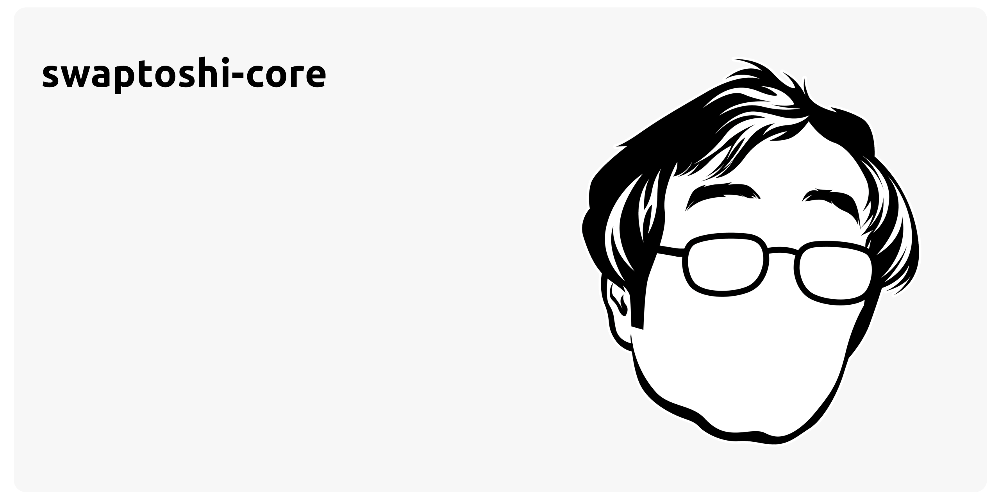

# Overview of Swaptoshi Core

The Swaptoshi Core blockchain client is an implementation of the Swaptoshi protocol that verifies data (blocks and transactions) against the protocol rules and keeps the network secure.

To provide a high level overview, the main functionalities are listed below:

- The possibility to connect to a subset of peers in the Swaptoshi's P2P network.
- To synchronize with the Swaptoshi blockchain including requesting, forwarding and processing of the blocks, which also contain the transactions.
- To maintain the transaction pool, which might contain a subset of unconfirmed transactions.
- To request and forward the unconfirmed transactions.
- To possibly generate new blocks when running a validator node.

Furthermore, Swaptoshi Core nodes are able to store all current addresses, balances, and transactions.

## Networks

After installation, Swaptoshi Core can be connected to the different Swaptoshi blockchain networks.

## Modules

The Swaptoshi Core v4 makes full use of the [modules defined by Klayr SDK v6](https://klayr.xyz/documentation/klayr-sdk/modules/index.html)
Apart from the aforementioned modules, Swaptoshi Core has an additional module which outlined on the [About Swaptoshi](../introduction/about-swaptoshi#modules) page

:::note

This Node Deployment documentation category is primarily based on the [Official Klayr Documentation](https://docs.klayr.xyz). Therefore, it is also recommended to visit their website for further details and a deeper understanding.

:::
